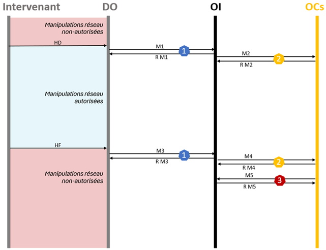

# E-Intervention Lot 1

## API de déclaration des interventions et de référencement des clients HS

### [Swagger disponible par ici](https://before-interop.github.io/E-Intervention/?urls.primaryName=E-Intervention-v1.0.0-OAS3)

### Rappel graphique des flux liés à l'API

