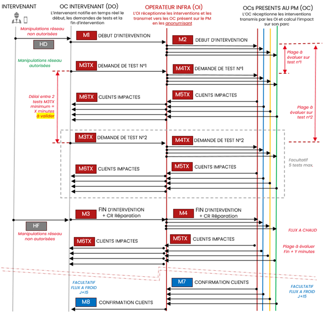

# E-Intervention Lot 2

## API de déclaration des interventions et de référencement des clients HS

### [Swagger disponible par ici](https://before-interop.github.io/E-Intervention/) au format OAS3

## Version des spécifications

Les spécifications YAML du Lot 2 utilisent la version fonctionnelle `2.5.0` et le format OpenAPI `3.0.2` :

- [INTERVENTION-DO v2.5.0](E-Intervention-DO-v2.5.0.OAS3.yaml)
- [INTERVENTION-OI v2.5.0](E-Intervention-OI-v2.5.0.OAS3.yaml)

Dans cette version, les champs absents de `required` acceptent explicitement la valeur `null` : 42 champs pour INTERVENTION-DO et 59 pour INTERVENTION-OI, soit 17 champs supplémentaires côté OI. Ce correctif concerne exclusivement les deux spécifications YAML.

### Rappel graphique des flux liés à l'API

### Rappel graphique des objets métier liés aux flux

#### Flux M1

#### Flux M2

#### Flux M3TX

#### Flux M4TX

#### Flux M5TX

#### Flux M6TX

#### Flux M3

#### Flux M3 Optionnel : Compte rendu d'intervention

Partie DO :

Partie OI:

#### Flux M4

