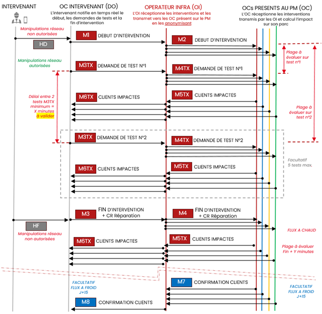

# E-Intervention

## API de déclaration des interventions et de référencement des clients HS

[Représentation de l'API](https://before-interop.github.io/E-Intervention/) au format OAS3

Cette API est issue des travaux du groupe Interop'Fibre : https://www.interop-fibre.fr/

### Rappel graphique des flux liés à l'API

### Rappel graphique des objets métier liés aux flux

#### Flux M1

#### Flux M2

#### Flux M3TX

#### Flux M4TX

#### Flux M5TX

#### Flux M6TX

#### Flux M3

#### Flux M3 Optionnel : Compte rendu d'intervention

Partie DO :

Partie OI:

#### Flux M4

